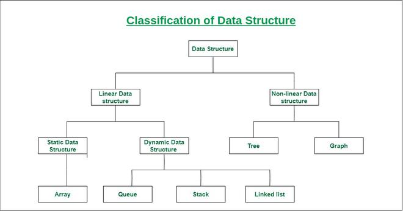
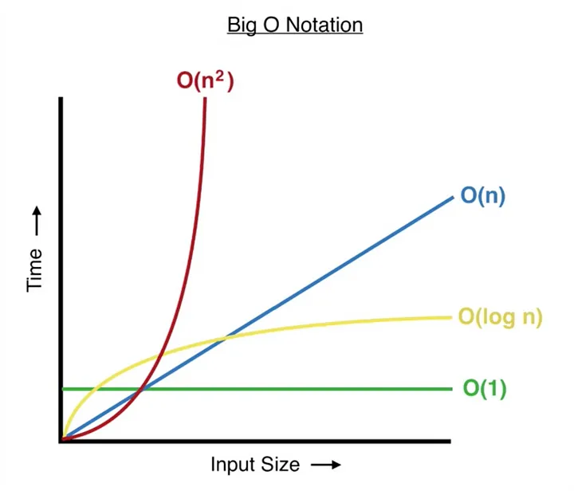

<!-- TOC -->
* [leetcode-exercises](#leetcode-exercises)
  * [Pycharm help](#pycharm-help)
  * [coderpad.io](#coderpadio)
    * [Code Template:](#code-template-)
    * [solution template](#solution-template)
  * [Techniques](#techniques)
  * [Data structures](#data-structures)
  * [Complexity](#complexity)
    * [O(1)](#o1)
    * [O(log(N))](#ologn)
    * [O(N)](#on)
    * [O(K log(N))](#ok-logn)
    * [O(N log(N))](#on-logn)
    * [O(N^2)](#on2)
    * [O(2^N)](#o2n)
    * [O(N!)](#on-1)
  * [Big O Notation Practice](#big-o-notation-practice)
  * [Keyword to Algorithm](#keyword-to-algorithm)
  * [Python Operators:](#python-operators)
    * [Arithmetic Operator](#arithmetic-operator)
    * [Bitwise Operators in Python](#bitwise-operators-in-python)
  * [Links:](#links)
  * [Videos](#videos)
<!-- TOC -->

# leetcode-exercises

Repository with multiple solutions in Python to resolve Leetcode exercises
https://leetcode.com/studyplan/top-interview-150/

## Pycharm help

Use to see print statements on the output console
`--log-cli-level=10`

## coderpad.io

### Code Template: 
```python
import pytest


class Solution:
    def isSubsequence(self, s: str) -> bool:

        return True


@pytest.mark.parametrize('s, expected_output', [
    ("aaaaaa", True),
])
def test(s, expected_output):
    solution = Solution()
    output = solution.isSubsequence(s)

    assert output == expected_output
    
# pytest.main(["-s", "-v"])
pytest.main()
```

```python
import pytest


class Solution:
    def isSubsequence(self, s: str) -> bool:

        return True

solution = Solution()

@pytest.mark.parametrize('s, expected_output', [
    ("aaaaaa", True),
])
class TestClass:
    def test_1(self, s, expected_output):
      output = solution.isSubsequence(s)
      assert output == expected_output
    
    
# pytest.main(["-s", "-v"])
pytest.main()
```

### solution template
[template.py](src%2Ftemplate.py)
- Intuition
- Approach
- Complexity

## Techniques

- Divide and conquer
  - problem-solving technique used to solve problems by dividing the main problem into sub-problems, 
    solving them individually and then merging them to find solution to the original problem.
  - divide -> conquer -> merge
- Two Pointers
  - used for Two Sum in Sorted Arrays, Closest Two Sum, Three Sum, Four Sum, Trapping Rain Water 
- Binary search
  - search algorithm used to find the position of a target value within a sorted array
  - It works by repeatedly dividing the search interval in half until the target value is found or the interval is empty.
  - The search interval is halved by comparing the target element with the middle value of the search space.
  - Time Complexity: O(log N) Auxiliary Space: O(1)
- Greedy Algorithm
  -  builds up a solution piece by piece, always choosing the next piece that offers the most obvious and immediate 
     benefit. Greedy algorithms are used for optimization problems.
  - work best when the problem exhibits the following properties:
    - Greedy Choice Property: The optimal solution can be constructed by making the best local choice at each step.
    - Optimal Substructure: The optimal solution to the problem contains the optimal solutions to its sub-problems.
  - Here’s how it works:
    - Start with the initial state of the problem. This is the starting point from where you begin making choices.
    - Evaluate all possible choices you can make from the current state. Consider all the options available at that 
      specific moment.
    - Choose the option that seems best at that moment, regardless of future consequences. This is the “greedy” part – 
      you take the best option available now, even if it might not be the best in the long run.
    - Move to the new state based on your chosen option. This becomes your new starting point for the next iteration.
    - Repeat steps 2-4 until you reach the goal state or no further progress is possible. Keep making the best local 
      choices until you reach the end of the problem or get stuck.
- Backtracking
  - Backtracking is like trying different paths, and when you hit a dead end, 
    you backtrack to the last choice and try a different route.
  - Types:
    - Decision Problems: Here, we search for a feasible solution.
    - Optimization Problems: For this type, we search for the best solution.
    - Enumeration Problems: We find set of all possible feasible solutions to the problems of this type.
  - Backtracking algorithms are best used to solve problems that have the following characteristics:
    - There are multiple possible solutions to the problem.
    - The problem can be broken down into smaller sub-problems.
    - The sub-problems can be solved independently.
  - Complexity
    - Exponential (O(K^N))
    - Factorial (O(N!))
  - At a high level, the template looks like this:
    ```python
     ans = [] # Note: This can be a set() as well
     
     def is_valid_state(state):
         # check if it is a valid solution
         return True
     
     def get_candidates(state):
         return []
     
     def backtrack(state):
         if is_valid_state(state):
             ans.append(state.copy())
             # return
     
         for candidate in get_candidates(state):
             state.append(candidate)
             backtrack(state)
             state.remove(candidate)
      
     state = []
     backtrack(state)
    ```
- Binary Search tree:
  - Search: 
    - We compare the value to be searched with the value of the root. 
    - If it’s equal we are done with the search if it’s smaller we know that we need to go to the left subtree because 
      in a binary search tree all the elements in the left subtree are smaller and all the elements in the right subtree 
      are larger. 
    - Repeat the above step till no more traversal is possible
    - If at any iteration, key is found, return True. Else False.
    - Time complexity: O(h), where h is the height of the BST.
      Auxiliary Space: O(h) This is because of the space needed to store the recursion stack.
    - recursive
      ```python
      # function to search a key in a BST
      def search(root, key):
  
        # Base Cases: root is null or key 
        # is present at root
        if root is None or root.key == key:
            return root
    
        # Key is greater than root's key
        if root.key < key:
            return search(root.right, key)
    
        # Key is smaller than root's key
        return search(root.left, key)
      ``` 
    - iterative:
      ```python
      def search_iterative(self, root, x):

        curr = root

        while curr is not None:

            # If curr node is x
            if curr.data == x:
                return True

            # Search in right subtree
            elif curr.data < x:
                curr = curr.right

            # Search in left subtree
            else:
                curr = curr.left

        # If x is not found.
        return False
      ```
  
- Binary tree: https://www.javatpoint.com/bfs-vs-dfs
  - Operations:
    - insert
    - search: most common methods are depth-first search (DFS) and breadth-first search (BFS)
  - DFS: Depth First Search, the stack data structure is used, which works on the LIFO (Last In First Out) principle
    explores as far down a branch as possible before backtracking. It is implemented using recursion. 
    - The main traversal methods in DFS for binary trees are:
      - Preorder Traversal (current-left-right)
      - Inorder Traversal (left-current-right)
      - Postorder Traversal (left-right-current)
  ```python
  def searchDFS(root, value):
     # Base case: If the tree is empty or we've reached a leaf node
     if root is None:
         return False
     # If the node's data is equal to the value we are searching for
     if root.data == value:
         return True
     # Recursively search in the left and right subtrees
     left_res = searchDFS(root.left, value)
     right_res = searchDFS(root.right, value)
 
     return left_res or right_res
  ```
  - BFS: Breadth First Search, level order traversal.[rotate_list.py](src%2FLinked_List%2Fmedium%2Frotate_list.py)
    - use deque (Queue)
    - ```python
      from collections import deque
      
      # Function to search for a value in the binary tree using DFS
      def searchBFS(root, value):
         if root is None:
            return None
    
         # Use a queue to perform BFS
         queue = deque([root])
     
         # Find the target node
         while queue:
             curr = queue.popleft()
     
             if curr.data == value:
                 return curr
             if curr.left:
                 queue.append(curr.left)
             if curr.right:
                 queue.append(curr.right)
      ```
    - ```python
      def bfs(root):
          if root is None:
              return
          queue = [root]
          while queue:
              node = queue.pop(0)
              print(node.data, end=' ')
              if node.left:
                  queue.append(node.left)
              if node.right:
                  queue.append(node.right)
      ```
- Graph:
  - BFS: Breadth First Search, level order traversal
    - Breadth First Search (BFS) is a fundamental graph traversal algorithm. It begins with a node, then first 
      traverses all its adjacent. Once all adjacent are visited, then their adjacent are traversed.
    - closest vertices are visited before others. We mainly traverse vertices level by level
    - Time Complexity: O(V+E), where V is the number of nodes and E is the number of edges. Auxiliary Space: O(V)
    - use deque
  - DFS: Depth First Search
    - we traverse all adjacent vertices one by one. When we traverse an adjacent vertex, we completely finish 
      the traversal of all vertices reachable through that adjacent vertex.
    - unlike trees, graphs may contain cycles
    - use recursion
    - To avoid processing a node multiple times, we use a boolean visited array.
    - Time complexity: O(V + E), where V is the number of vertices and E is the number of edges in the graph.
      Auxiliary Space: O(V + E), since an extra visited array of size V is required, And stack size for recursive calls 
      to DFSRec function.
- Dynamic programing
  - mainly an optimization over plain recursion
  - simply store the results of sub-problems so that we do not have to re-compute them when needed later
  - typically reduces time complexities from exponential to polynomial.
  - store solutions to sub-problems so that each is solved only once.
  - two ways to store the results, one is top down (or memoization) and other is bottom up (or tabulation).
  - used when there are overlapping sub-problems (the same sub-problem is executed multiple times)
    - Memoization:
      - Top-down approach
      - Stores the results of function calls in a table.
      - Recursive implementation
      - Entries are filled when needed.
    - Tabulation:
      - Bottom-up approach
      - Stores the results of sub-problems in a table
      - Iterative implementation
      - Entries are filled in a bottom-up manner from the smallest size to the final size.
- Kadanes algorithm
  - Maximum Subarray
  - Kadane’s algorithm is to traverse over the array from left to right and for each element, find the maximum sum among
    all sub-arrays ending at that element. The result will be the maximum of all these values. 
  - O(n) Time and O(1) Space
- Sliding windows
  - problems in which a fixed or variable-size window is moved through a data structure, typically an array or string, 
    to solve problems efficiently based on continuous subsets of elements. This technique is used when we need to 
    find sub-arrays or substrings according to a given set of conditions.
- Intervals
  - subset of array questions where you are given an array of two-element arrays (an interval) and the two values 
    represent a start and an end value
  - A common routine for interval questions is to sort the array of intervals by each interval's starting value.
  

## Data structures



- Hashmap
  - Hash maps are indexed data structures. A hash map makes use of a hash function to compute an index with a 
    key into an array of buckets or slots.
  - Its value is mapped to the bucket with the corresponding index. The key is unique and immutable.
- Sets in Python
  - used to store a collection of items with the following properties.
    - No duplicate elements. If try to insert the same item again, it overwrites previous one.
    - An unordered collection. When we access all items, they are accessed without any specific order, and we cannot 
      access items using indexes as we do in lists.
    - Internally use hashing that makes set efficient for search, insert and delete operations.
      It gives a major advantage over a list for problems with these operations.
    - Mutable, meaning we can add or remove elements after their creation, the individual elements within the set 
      cannot be changed directly.
  - Operations:
    - insert: O(1)
    - union
    - intersection
    - difference
- Stacks (LIFO)
  - The stack is a basic data structure in which the insertion of new elements takes place at the top 
    and deletion of elements also takes place from the top
- Heaps [average_of_levels_in_binary_tree.py](src%2Fbinary_tree_bfs%2Feasy%2Faverage_of_levels_in_binary_tree.py)
  - A Heap is a complete binary tree data structure that satisfies the heap property: 
    for every node, the value of its children is greater than or equal to its own value. 
  - Heaps are usually used to implement priority queues, where the smallest (or largest) element is always at the root 
    of the tree.
  - use heapq.heapify(heap)
- Queues (FIFO)
  - The queue is a basic data structure in which new elements are inserted at the 
    back but old elements are removed from the front
- Hash Tables
  - Hashtable is synchronized, whereas HashMap is not.
  - Hashtable does not allow null keys or values. HashMap allows one null key and any number of null values.
  - One of HashMap's subclasses is LinkedHashMap, so in the event that you'd want predictable iteration order 
    (which is insertion order by default), you could easily swap out the HashMap for a LinkedHashMap. 
     This wouldn't be as easy if you were using Hashtable.
- Linked Lists
  - It mainly allows efficient insertion and deletion operations compared to arrays. Like arrays, it is also used to 
    implement other data structures like stack, queue and deque.
  - Data Structure: Non-contiguous
    Memory Allocation: Typically allocated one by one to individual elements
    Insertion/Deletion: Efficient
    Access: Sequential
- Trees
  - hierarchical structure that is used to represent and organize data in the form of parent child relationship. 
  - The following are some real world situations which are naturally a tree.
    - Folder structure in an operating system.
    - Tag structure in an HTML (root tag the as html tag) or XML document.
  - The topmost node of the tree is called the root, and the nodes below it are called the child nodes.
    Each node can have multiple child nodes, and these child nodes can also have their own child nodes, 
    forming a recursive structure.
- Trie
  - Tree based data structure that is used for storing some collection of strings and performing 
    efficient search operations on them.
  - Representation of trie is similar to a tree data structure with a root node connected to its elements in a 
    structured way with leaf nodes representing the end.
  - Applications
    - Autocomplete
    - Spell checking
- Graphs
  - non-linear data structure consisting of vertices and edges
  - The vertices are sometimes also referred to as nodes and the edges are lines or arcs that connect any two nodes 
    in the graph. set of vertices( V ) and a set of edges( E ). The graph is denoted by G(V, E).


## Complexity



### O(1)
Constant time complexity. Could be

- Hashmap lookup
- Array access and update
- Pushing and popping elements from a stack
- Finding and applying math formula
- Typically for n > 10⁹

### O(log(N))
log(N) grows VERY slowly.

In coding interviews, log(N) typically means
- Binary search or variant
- Balanced binary search tree lookup
- Processing the digits of a number
- Typically for n > 10⁸

### O(N)
Linear time typically means looping through a linear data structure a constant number of times. 
Most commonly, this means:
- Going through array/linked list
- Two pointers
- Some types of greedy
- Tree/graph traversal
- Stack/Queue
- Typically for n ≤ 10⁶

### O(K log(N))
- Heap push/pop K times. When you encounter problems that seek the "top K elements", 
you can often solve them by pushing and popping to a heap K times, resulting in an O(K log(N)) runtime. e.g., 
K closest points, merge K sorted lists.
- Binary search K times.
- Typically for n ≤ 10⁶

###  O(N log(N))
- Sorting. The default sorting algorithm's expected runtime in all mainstream languages is N log(N). 
For example, java uses a variant of merge sort for object sorting and a variant of Quick Sort for primitive type sorting.
- Timsort: Tim Sort is a hybrid sorting algorithm derived from merge sort and insertion sort. It was designed to perform 
  well on many kinds of real-world data
- Divide and conquer with a linear time merge operation. Divide is normally log(N), and if merge is O(N) then 
the overall runtime is O(N log(N)). An example problem is smaller numbers to the right.
- Typically for n ≤ 10⁶

### O(N^2)
Also called quadratic time.

- Nested loops, e.g., visiting each matrix entry
- Many brute force solutions
- Typically, for n ≤ 3000

### O(2^N)
Grows very rapidly. Often requires memoization to avoid repeated computations and reduce complexity.
- Combinatorial problems, backtracking, e.g. subsets
- Often involves recursion and is harder to analyze time complexity at first sight
- Further detailed code examples can be found in the backtracking section
- Typically for n ≤ 20

A recursive Fibonacci algorithm is O(2^N) because for any Fib(i) where i > 1, we call Fib(i - 1) and Fib(i - 2).

### O(N!)
Grows insanely rapidly. Only solvable by computers for small N. Often requires memoization to avoid repeated 
computations and reduce complexity.

- Combinatorial problems, backtracking, e.g. permutations
- Often involves recursion and is harder to analyze time complexity at first sight
- Detailed code examples can be found in the backtracking section
- Typically, for n ≤ 12

## Big O Notation Practice
Answers for these questions will be at the end of this article.

What is the asymptotic time bound of functions with these time complexities?
- 3N + 2N + N => O(N)
- 2N^3 + 5N^2 => O(N^3)
- N + log(N)  => O(N)
- N^2log(N)   => O(N^2 Log(N))
- 2^N + N^2   => O(2^N)
- 10          => O(1)
- O(2^log(N)) => O(N)

## Keyword to Algorithm

"Top k"
- Heap: K closest points

"How many ways.."
- DFS: Decode ways
- DP: Robot paths

"Substring"
- Sliding window: Longest substring without repeating characters
- "Palindrome"
- two pointers: Valid Palindrome
- DFS: Palindrome Partitioning
- DP: Palindrome Partitioning II

"Tree"
- shortest, level-order
- BFS: Binary Tree Level-Order Traversal
- else: DFS: Max Depth

"Parentheses"
- Stack: Valid Parentheses

"Subarray"
- Sliding window: Maximum subarray sum
- Prefix sum: Subarray sum
- Hashmap: Continuous subarray sum
- Max subarray
- Greedy: Kadane's Algorithm

"X Sum"
- Two pointer: Two sum

"Max/longest sequence"
- Dynamic programming, DFS: Longest increasing subsequence
- mono deque: Sliding window maximum

"Minimum/Shortest"
- Dynamic programming, DFS: Minimal path sum
- BFS: Shortest path

"Partition/split ... array/string"
- DFS: Decode ways

"Subsequence"
- Dynamic programming, DFS: Longest increasing subsequence
- Sliding window: Longest increasing subsequence

"Matrix"
- BFS, DFS: Flood fill, Islands
- Dynamic programming: Maximal square

"Jump"
- Greedy/DP: Jump game

"Game"
- Dynamic programming: Divisor game, Stone game

"Connected component", "Cut/remove" "Regions/groups/connections"
- Union Find: Number of connected components, Redundant connections

Transitive relationship
If the items are related to one another and the relationship is transitive, 
then chances are we can build a graph and use BFS or Union Find.

- string converting to another, BFS: Word Ladder
- string converting to another, BFS, Union Find: Sentence Similarity
- numbers having divisional relationship, BFS, Union Find: Evaluate Division

"Interval"
- Greedy: sort by start/end time and then go through sorted intervals Interval Pattern

## Python Operators:

### Arithmetic Operator
```python
a = 15
b = 4

# Addition
print("Addition:", a + b)  

# Subtraction
print("Subtraction:", a - b) 

# Multiplication
print("Multiplication:", a * b)  

# Division
print("Division:", a / b) 

# Floor Division
print("Floor Division:", a // b)  

# Modulus
print("Modulus:", a % b) 

# Exponentiation
print("Exponentiation:", a ** b)
```

### Bitwise Operators in Python
- Bitwise NOT
- Bitwise Shift
- Bitwise AND
- Bitwise XOR
- Bitwise OR

```python
a = 10
b = 4

print(a & b) # 0 
print(a | b) # 14
print(~a) # -11
print(a ^ b) # 14
print(a >> 2) # 2
print(a << 2) # 40
```

## Links:
- https://docs.pytest.org/en/stable/how-to/parametrize.html
- https://www.crackingthecodinginterview.com/uploads/6/5/2/8/6528028/cracking_the_coding_skills_-_v6.pdf
- https://www.geeksforgeeks.org/dynamic-programming/
- https://www.geeksforgeeks.org/introduction-to-greedy-algorithm-data-structures-and-algorithm-tutorials/
- https://www.geeksforgeeks.org/introduction-to-backtracking-2/
- https://algo.monster/problems/runtime_summary
- https://algo.monster/problems/keyword_to_algo
- https://www.w3schools.com/python/default.asp
- https://realpython.com/sorting-algorithms-python/
- https://docs.python.org/3/reference/index.html
- https://www.geeksforgeeks.org/heap-data-structure/
- https://www.geeksforgeeks.org/timsort/

## Videos
- [Algorithms](https://www.youtube.com/watch?v=KEEKn7Me-ms&list=PLI1t_8YX-ApvMthLj56t1Rf-Buio5Y8KL)
- [Data Structures](https://www.youtube.com/watch?v=IhJGJG-9Dx8&list=PLI1t_8YX-Apv-UiRlnZwqqrRT8D1RhriX)
- [Big O](https://youtu.be/v4cd1O4zkGw)
- [You only need 150 LeetCode questions](https://www.youtube.com/watch?v=J_a4DEw-kCQ)
